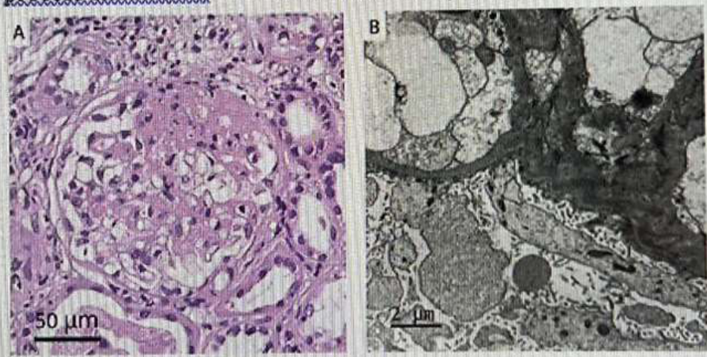

# 115 年台灣腎臟醫學會腎臟專科醫師甄試臨床應用考題 (Questions 1 - 8)

## Overview

本文件彙整「115 年台灣腎臟醫學會腎臟專科醫師甄試臨床應用考題」第 1 至 8 題之完整題目、選項、正確答案、原始備註，並結合病理圖片與臨床高頻考點分析。

---

## Question 1

### Question Stem
A 38-year-old woman with a history of bilateral renal stones presented with sudden onset weakness of all four limbs. Arterial blood gas analysis showed pH 7.26, PaCO2 31.1 mmHg, and bicarbonate 13.9 mmol/L. Serum laboratory tests revealed sodium 134 mmol/L, potassium 2.0 mmol/L, chloride 113 mmol/L, blood urea nitrogen 27 mg/dL, and creatinine 1.8 mg/dL. Urine studies demonstrated urine sodium 73 mmol/L, urine potassium 16 mmol/L, and urine chloride 73 mmol/L. A 24-hour urine potassium excretion was 82 mEq/day. The patient developed progressive quadriparesis and respiratory failure requiring mechanical ventilation. What is the most likely cause of her metabolic acidosis and hypokalemia?

### Options
- (A) Gitelman syndrome
- (B) Hyperthyroid periodic paralysis
- (C) Euglycemic diabetic ketoacidosis due to sodium-glucose cotransporter-2 inhibitor
- (D) Distal renal tubular acidosis due to Sjögren syndrome

### Correct Answer
**(D) Distal renal tubular acidosis due to Sjögren syndrome**

### Original Source Remarks
This patient had severe hypokalemia, normal anion gap metabolic acidosis, renal potassium wasting, and bilateral renal stones, which are classic findings of distal renal tubular acidosis (type 1 RTA). Sjögren syndrome is a common autoimmune cause of distal RTA, and hypokalemic paralysis may occur before sicca symptoms appear. Severe potassium depletion may progress to respiratory failure.

### Clinical Key Points
- **Acid-Base & Electrolytes**: 病患表現為 severe hypokalemia (K+ 2.0 mmol/L) 伴隨 normal anion gap metabolic acidosis (NAGMA, Na 134 - Cl 113 - HCO3 13.9 = AG 7.1)。
- **Renal Potassium Wasting**: 24-hour urine K+ 高達 82 mEq/day (> 20-30 mEq/day)，確認為腎臟排鉀過量。
- **Clinical Complications**: 嚴重低血鉀導致 quadriparesis 及呼吸肌麻痺引起 respiratory failure，且有雙側 renal stones 史。
- **Etiology**: Sjögren syndrome 為成人 distal RTA (type 1 RTA) 最常見的 autoimmune 誘因，常於 sicca symptoms 出現前即以 hypokalemic paralysis 首發。

---

## Question 2

### Question Stem
A 56-year-old woman with type 2 diabetes mellitus presented after a suicide attempt with progressive acidemia. Initial laboratory tests showed pH 7.256, bicarbonate 19.5 mmol/L, and PaCO2 44.9 mmHg. Seven hours later, laboratory evaluation revealed pH 7.082, bicarbonate 5.3 mmol/L, lactate 28.8 mmol/L, and serum creatinine 1.87 mg/dL. What is the most likely diagnosis of metabolic acidosis?

### Options
- (A) Diabetic ketoacidosis
- (B) Metformin-associated lactic acidosis
- (C) Methanol intoxication
- (D) Ethylene glycol intoxication

### Correct Answer
**(B) Metformin-associated lactic acidosis**

### Original Source Remarks
The patient developed severe high anion gap metabolic acidosis with markedly elevated lactate levels, characteristic of metformin-associated lactic acidosis (MALA). Metformin impairs mitochondrial oxidative metabolism and increases lactate production, resulting in profound hyperlactatemia and severe acidemia.

### Clinical Key Points
- **Presentation**: 服藥過量意圖自殺後呈現劇烈惡化之 high anion gap metabolic acidosis (HAGMA)。
- **Laboratory Biomarkers**: 血中 lactate 顯著升至 28.8 mmol/L，pH 降至 7.082，HCO3- 掉至 5.3 mmol/L。
- **Pathophysiology**: Metformin 抑制 mitochondrial complex I，阻斷 mitochondrial oxidative metabolism，導致乳酸生成大幅增加並抑制肝臟 gluconeogenesis 對乳酸的清除，造成典型 MALA。

---

## Question 3

### Question Stem
A 54-year-old Asian man with a history of biopsy-proven focal segmental glomerulosclerosis (FSGS) achieved remission after corticosteroid and immunosuppressive therapy. Five years later, one month after receiving the second dose of the Oxford-AstraZeneca COVID-19 vaccine, he developed bilateral leg edema, nephrotic-range proteinuria, and severe acute kidney injury. Laboratory examination revealed blood urea nitrogen 96.9 mg/dL, serum creatinine 9.60 mg/dL, serum albumin 2.5 g/dL, and urine protein-creatinine ratio 23.0 g/g. ANA, ANCA, and anti-GBM antibodies were negative. Kidney biopsy demonstrated segmental glomerular sclerosis and diffuse podocyte foot process effacement. What is the most likely diagnosis?

### Biopsy Pathology Images

*Figure 3: Kidney biopsy images. (A) Light microscopy showing segmental glomerular sclerosis (scale bar 50 µm). (B) Electron microscopy showing diffuse podocyte foot process effacement (scale bar 1 µm).*

### Options
- (A) Minimal change disease
- (B) Membranous nephropathy
- (C) Focal segmental glomerulosclerosis
- (D) Lupus nephritis

### Correct Answer
**(C) Focal segmental glomerulosclerosis**

### Original Source Remarks
Kidney biopsy demonstrated segmental glomerular sclerosis on light microscopy and diffuse podocyte foot process effacement on electron microscopy, characteristic findings of focal segmental glomerulosclerosis (FSGS). The clinical course and pathology support relapsed primary FSGS after COVID-19 vaccination.

### Clinical Key Points
- **Clinical Scenario**: 原本緩解之 FSGS 病患，於施打 Oxford-AstraZeneca COVID-19 vaccine 第二劑一個月後復發 nephrotic syndrome 併發 severe acute kidney injury (Cr 9.60 mg/dL, UPCR 23.0 g/g)。
- **Pathology Findings**:
  - **Light Microscopy (Figure 3A)**: 顯示特徵性 segmental glomerular sclerosis。
  - **Electron Microscopy (Figure 3B)**: 顯示廣泛之 diffuse podocyte foot process effacement。
- **Diagnosis**: 臨床與病理確診為疫苗誘發之 relapsed primary FSGS。

---

## Question 4

### Question Stem
A 51-year-old woman with a history of hypertension and hyperlipidemia presented with foamy urine and acute kidney injury several weeks after receiving her third dose of the mRNA-1273 COVID-19 vaccine. Laboratory examination revealed serum creatinine 3.28 mg/dL, urine protein-creatinine ratio 2.61 mg/mg, negative ANA, ANCA, and anti-GBM antibodies, with normal complement levels. Kidney biopsy demonstrated tubulointerstitial nephritis with C3-dominant immune complex deposits and electron-dense deposits. What is the most likely diagnosis?

### Options
- (A) IgA nephropathy
- (B) Membranous nephropathy
- (C) Minimal change disease
- (D) C3 glomerulonephritis
- (E) Lupus nephritis

### Correct Answer
**(D) C3 glomerulonephritis**

### Original Source Remarks
The biopsy findings of C3-dominant deposits and electron-dense deposits are characteristic of C3 glomerulonephritis (C3GN), a subtype of C3 glomerulopathy associated with dysregulation of the alternative complement pathway.

### Clinical Key Points
- **Clinical Scenario**: 接種 mRNA-1273 COVID-19 vaccine 第三劑後數週出現蛋白尿與 acute kidney injury。
- **Biopsy Findings**: 腎臟切片免疫螢光與電顯呈現 C3-dominant immune complex deposits 以及 electron-dense deposits。
- **Diagnosis**: 典型之 C3 glomerulonephritis (C3GN)，屬於 alternative complement pathway 調控失常導致之 C3 glomerulopathy。

---

## Question 5

### Question Stem
A 49-year-old woman presented with abdominal distension and oliguria 1 month after hysterectomy. Laboratory tests showed BUN 58 mg/dL, serum creatinine 3.1 mg/dL, sodium 124 mmol/L, and albumin 2.0 g/dL. Urinalysis revealed hematuria and proteinuria. Ultrasound demonstrated massive ascites with normal kidneys and no hydronephrosis. Ascitic fluid creatinine was 8.4 mg/dL, markedly higher than serum creatinine. After Foley catheter placement, urine output rapidly increased and serum creatinine normalized within 24 hours. What is the most likely diagnosis?

### Options
- (A) Acute tubular necrosis
- (B) Hepatorenal syndrome
- (C) Pseudo-renal failure due to bladder rupture
- (D) Rapidly progressive glomerulonephritis
- (E) Nephrotic syndrome

### Correct Answer
**(C) Pseudo-renal failure due to bladder rupture**

### Original Source Remarks
Bladder rupture after gynecologic surgery caused urinary ascites. Creatinine-rich urine was reabsorbed through the peritoneum, leading to apparent acute kidney injury ("pseudo-renal failure"). Rapid recovery after bladder drainage strongly supports the diagnosis.

### Clinical Key Points
- **Surgical History**: 婦產科 hysterectomy 手術史，1 個月後出現少尿與腹脹。
- **Diagnostic Hallmark**: 腹水分析顯示 ascitic fluid creatinine (8.4 mg/dL) 遠高於 serum creatinine (3.1 mg/dL)，證實為 urinary ascites。
- **Reversibility**: 置入 Foley catheter 導尿後，尿量迅速增加且 serum creatinine 於 24 小時內恢復正常，為典型的 pseudo-renal failure。

---

## Question 6

### Question Stem
A 73-year-old Asian man with stage 3 chronic kidney disease, bronchiectasis, and glaucoma presented with progressive dyspnea, weakness, anorexia, abdominal discomfort, and weight loss for 1 month after starting brinzolamide/timolol eye drops. Laboratory tests showed pH 7.29, HCO3- 8.9 mEq/L, PaCO2 18.8 mmHg, creatinine 3.9 mg/dL, potassium 3.3 mEq/L, anion gap 15.1 mEq/L, urine anion gap +33.4 mEq/L, and fractional excretion of bicarbonate 4.3%. Lactate and ketone tests were negative. What is the most likely diagnosis?

### Options
- (A) Uremic metabolic acidosis from CKD alone
- (B) Type 4 renal tubular acidosis
- (C) Carbonic anhydrase inhibitor-induced renal tubular acidosis
- (D) Lactic acidosis
- (E) Diarrhea-related bicarbonate loss

### Correct Answer
**(C) Carbonic anhydrase inhibitor-induced renal tubular acidosis**

### Original Source Remarks
Brinzolamide is a topical carbonic anhydrase inhibitor that can be systemically absorbed and impair bicarbonate reabsorption and hydrogen ion secretion, causing renal tubular acidosis. Hypokalemia and a positive urine anion gap support the diagnosis of renal tubular acidosis.

### Clinical Key Points
- **Etiology**: 點用青光眼眼藥水 brinzolamide (topical carbonic anhydrase inhibitor) 後經系統性吸收引起。
- **Laboratory Profile**: NAGMA 伴隨低血鉀 (K+ 3.3 mEq/L)、positive urine anion gap (+33.4 mEq/L) 以及 FE-HCO3- 升至 4.3%。
- **Mechanism**: 碳酸酐酶受抑制後干擾近曲小管重吸收碳酸氫根與遠曲小管酸分泌，造成 RTA。

---

## Question 7

### Question Stem
A 68-year-old man with autosomal dominant polycystic kidney disease received a deceased-donor kidney transplant 18 years ago. He presented with recurrent cutaneous squamous cell carcinoma, developing 5 to 6 localized skin cancers annually. His immunosuppressive regimen included tacrolimus and prednisone after discontinuation of azathioprine 2 years earlier. What is the most appropriate management strategy?

### Options
- (A) Restart azathioprine
- (B) Convert tacrolimus to sirolimus
- (C) Add mycophenolate mofetil
- (D) Start vitamin C supplementation
- (E) Start systemic cisplatin therapy

### Correct Answer
**(B) Convert tacrolimus to sirolimus**

### Original Source Remarks
Conversion from calcineurin inhibitors to an mTOR inhibitor such as sirolimus is associated with a lower risk of recurrent non-melanoma skin cancers in kidney transplant recipients. Azathioprine may accelerate progression of cutaneous squamous cell carcinoma and should be avoided.

### Clinical Key Points
- **Clinical Challenge**: 腎臟移植長期受者併發反覆皮膚 squamous cell carcinoma (每年 5-6 處)。
- **Evidence-Based Strategy**: 將 calcineurin inhibitor (tacrolimus) 轉換為具備抗腫瘤活性之 mTOR inhibitor (sirolimus)，可顯著降低 non-melanoma skin cancer 之復發率。
- **Contraindicated Drug**: Azathioprine 會增加日光皮膚癌風險，應避免重開。

---

## Question 8

### Question Stem
A 34-year-old female recreational runner collapsed shortly after completing a marathon held in warm weather. She reported nausea, lightheadedness, and confusion. She drank approximately 3.5 liters of water during the race without electrolyte supplementation. Physical examination showed confusion without focal neurological deficits. Laboratory evaluation revealed serum sodium 122 mEq/L, and body weight increased by 2% compared with prerace weight. What is the most appropriate next step in management?

### Options
- (A) Administer isotonic saline
- (B) Restrict water intake and observe
- (C) Administer hypertonic saline
- (D) Encourage oral electrolyte solution

### Correct Answer
**(C) Administer hypertonic saline**

### Original Source Remarks
This patient has symptomatic exercise-associated hyponatremia with confusion and severe hyponatremia. Weight gain during the race suggests excessive free water intake causing hypervolemic hyponatremia. Hypertonic saline is indicated to rapidly reverse cerebral edema and prevent seizures or coma.

### Clinical Key Points
- **Diagnosis**: 馬拉松長跑後補充大量純水，體重增加 2% 且血鈉降至 122 mEq/L，呈現症狀性 exercise-associated hyponatremia (EAH)。
- **Acute Management**: 呈現意識混亂 (confusion) 等神經學症狀時，為避免引發致命性 cerebral edema、seizures 或 coma，首選急救處置為立即給予 **hypertonic saline (3% NaCl)**。

